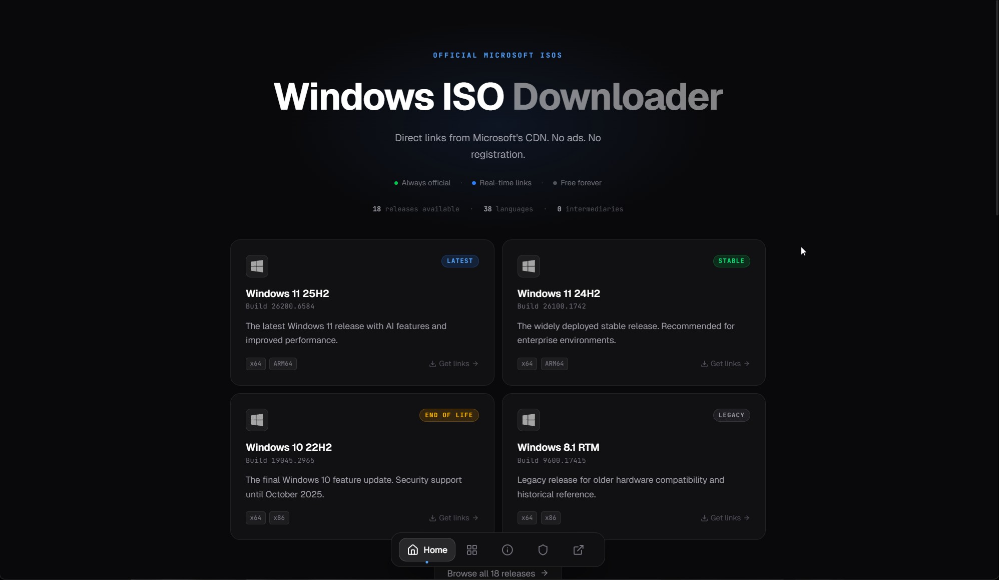
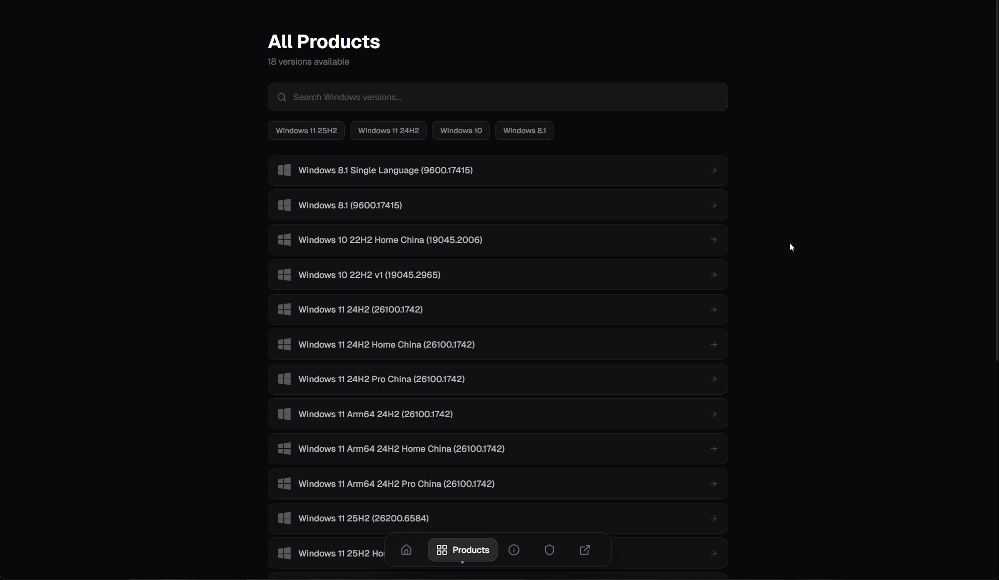
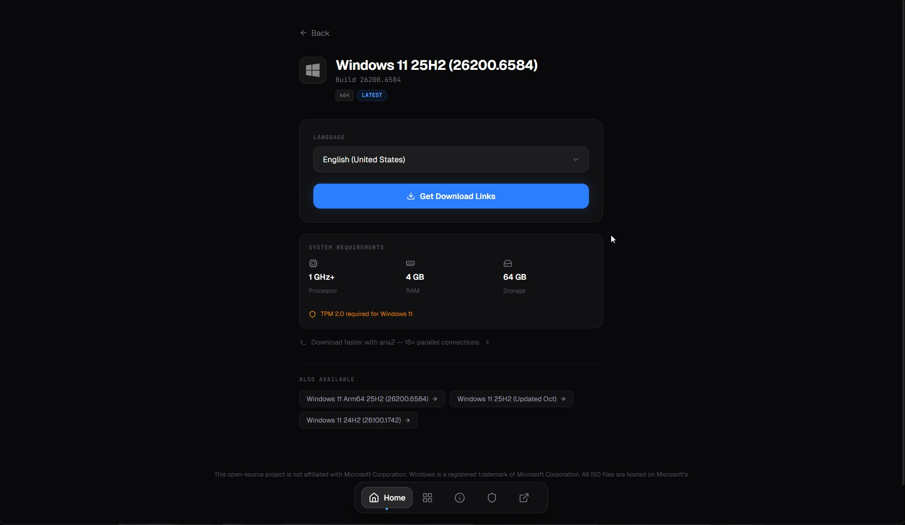
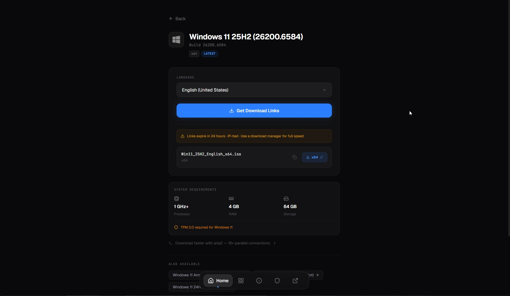

# windows-iso-downloader

> A clean, open-source tool for obtaining official Windows ISO files directly from Microsoft's CDN — without a Windows machine, the Media Creation Tool, or browser restrictions.

**Live:** [msdl.tech-latest.com](https://msdl.tech-latest.com) · **By:** [TechLatest](https://tech-latest.com)


---

## What it does

MSDL replicates the session flow that Microsoft uses to serve ISO download links — identical to the approach used by [Rufus/Fido](https://github.com/pbatard/Fido). You get the exact same signed CDN URL Microsoft would give you, just without the browser requirement.

- ✅ Direct Microsoft CDN links — no proxying of actual file data
- ✅ 38 languages per consumer release
- ✅ ARM64 + x64 + x86 support
- ✅ Windows Server 2016–2025 and Windows 11 Enterprise evaluation ISOs
- ✅ No account, no browser lock, no ads, no tracking
- ✅ Consumer links expire in 24 hours (Microsoft's standard behaviour, not a limitation)

---

## Screenshots

| Home | All Releases |
|---|---|
|  |  |

| Product detail — language selector | Product detail — download links |
|---|---|
|  |  |

---

## CLI Tool

`msdl` is a standalone command-line tool that fetches Windows ISO links directly from your machine — no browser, no server in the middle.

```bash
# Interactive — pick product and language
msdl

# Direct with flags
msdl --id 3262 --lang "English"

# Evaluation / Server ISOs
msdl --eval server-2025

# Pipe directly into a downloader
msdl --id 3262 --lang "English" | wget -i -
msdl --id 3262 --lang "English" | xargs aria2c -x 16 -s 16

# List all available products
msdl --list
```

### Install

**Windows (winget):**
```
winget install starkSV.msdl
```

**macOS / Linux (Homebrew):**
```bash
brew tap starkSV/msdl
brew install msdl-cli
```
(the formula is named `msdl-cli`, not `msdl` — `homebrew/core` already has an unrelated package called `msdl`; the installed command is still just `msdl`)

**macOS / Linux (no Homebrew):**
```bash
curl -fsSL https://api.msdl.tech-latest.com/install.sh | bash
```
Auto-detects OS/arch (including Termux on Android) and installs the latest release.

**Direct download:** Grab the latest binary from [GitHub Releases](https://github.com/starkSV/windows-iso-downloader/releases/latest) and rename it:

| Platform | File | Rename to |
|---|---|---|
| Windows | `msdl-windows-amd64.exe` | `msdl.exe` |
| macOS (Apple Silicon) | `msdl-darwin-arm64` | `msdl` |
| macOS (Intel) | `msdl-darwin-amd64` | `msdl` |
| Linux (x86_64) | `msdl-linux-amd64` | `msdl` |
| Linux (ARM64, incl. Termux on Android) | `msdl-linux-arm64` | `msdl` |

An AUR package (`msdl-bin`) is prepared but not yet published — Arch Linux disabled new AUR registrations after a [malware incident](https://itsfoss.com/news/arch-linux-aur-malware-flood/); see [`aur/msdl-bin`](./aur/msdl-bin) for status.

### Crowdsourced cache

By default, each successful fetch is contributed back to the web app's cache — so the next visitor gets a cached link instead of hitting Microsoft cold. Contribution is a background POST to `/contribute`. No personal data is sent — only the product ID, SKU ID, and the raw Microsoft JSON response. To opt out:

```bash
msdl --id 3262 --lang "English" --no-contribute
# or: MSDL_NO_CONTRIBUTE=1
```

### Usage telemetry

By default, each run sends an anonymous event to help us understand which products are popular and which platforms are used. No personal data is sent — only action type (`fetch`, `eval`, `list`, `interactive`), platform (`windows`, `darwin`, `linux`), CLI version, and whether the run succeeded. To opt out:

```bash
MSDL_NO_TELEMETRY=1 msdl --id 3262 --lang "English"
```

---

## Project Structure

```
windows-iso-downloader/
├── frontend/            # React 19 + TypeScript + Vite + Tailwind v4
├── backend/             # Go proxy server (recommended for production)
├── cli/                 # Go CLI — direct ISO fetching from user's machine
├── cloudflare-worker/   # Optional CF Worker for distributed IP routing
└── README.md
```

---

## How It Works

```
Browser → Backend → (CF Worker) → Microsoft API → Signed CDN URL
              ↓
         Cache check (hit → return immediately, no Microsoft call)
              ↓ miss
          1. Register session (Microsoft tracking endpoint)
          2. Parse MDT fingerprint script
          3. Fetch SKU list (available languages)
          4. Fetch signed CDN download URL
          5. Cache result → return to browser
```

The flow mirrors [Fido.ps1](https://github.com/pbatard/Fido) by Pete Batard — the same script bundled with Rufus.

Outbound requests to Microsoft are optionally routed through a Cloudflare Worker (`cloudflare-worker/worker.js`). This distributes requests across Cloudflare's global edge IPs instead of a single server IP, preventing Microsoft's rate-limit block (error 715-123130) under high traffic. The Worker is opt-in via environment variables — omit them to go direct to Microsoft.

### Caching layer

The backend uses a four-layer in-memory cache to reduce Microsoft API calls from thousands per day to ~50–100, preventing the 715-123130 rate-limit block under real traffic.

| Cache | Key | TTL | Purpose |
|---|---|---|---|
| SKU cache | `product_id` | 7 days | Language lists are stable; no need to hit Microsoft on every page load |
| Link cache | `product_id:sku_id` | Dynamic (parsed from `se` param in the signed URL, minus 30 min buffer) | Signed CDN URLs are not IP-bound — safe to serve the same link to all users |
| Eval cache | `slug` | 24 hours | Eval Center fwlink redirects change rarely |
| Negative cache | `product_id` or `product_id:sku_id` | 60 seconds | Prevents thundering-herd retries during a rate-limit block |

Additional resilience mechanisms:

- **Singleflight** (`golang.org/x/sync/singleflight`) — collapses concurrent cache misses into a single Microsoft fetch. 500 simultaneous misses → 1 outbound call.
- **Stale-on-failure** — if a cache refresh fails (rate-limited or transient error), the expired entry is served temporarily while a background refresh is attempted through singleflight.
- **Jitter** — ±5 min random offset on TTLs prevents synchronized mass-expiry spikes.
- **Cache eviction** — a background goroutine evicts expired entries every 30 minutes.

All caches are in-memory and reset on restart. If `REDIS_URL` is set, a Redis/Valkey L2 cache supplements the in-memory layer: on startup the in-memory cache is seeded from Redis (restart-safe), and every fresh Microsoft fetch is written through to Redis. If Redis is unavailable the backend falls back to memory-only mode silently. Monitor the cache via the [`/metrics` endpoint](#get-metricssecret).

---

## Running Locally

### Backend (Go)

```bash
cd backend
go run main.go
# Runs on http://localhost:3002
```

### Frontend

```bash
cd frontend
npm install
npm run dev
# Runs on http://localhost:5173
```

Create `frontend/.env.local`:

```env
VITE_API_URL=http://localhost:3002
```

#### Optional: Cloudflare Worker (recommended for production)

Deploy `cloudflare-worker/worker.js` to Cloudflare Workers, then set these on the backend:

```env
CF_WORKER_URL=https://your-worker.your-name.workers.dev
CF_WORKER_SECRET=your-secret   # must match the CF_WORKER_SECRET secret set in the Worker's settings
METRICS_SECRET=your-metrics-secret  # enables the /metrics endpoint; omit to disable it
```

Omit `CF_WORKER_URL` / `CF_WORKER_SECRET` to go direct to Microsoft (fine for local development and low-traffic self-hosting).

---

## API Reference

### `GET /skuinfo?product_id=<id>`

Returns available languages for a product.

```json
{
  "Skus": [
    {
      "Id": "0x0409",
      "Language": "en-US",
      "LocalizedLanguage": "English (United States)"
    }
  ]
}
```

### `GET /proxy?product_id=<id>&sku_id=<sku>`

Returns signed download links from Microsoft's CDN.

```json
{
  "ProductDownloadOptions": [
    {
      "Uri": "https://software.download.prss.microsoft.com/...",
      "Architecture": "x64"
    }
  ]
}
```

### `GET /evallinks?product=<slug>`

Returns direct CDN links for evaluation ISOs (Server/Enterprise). Links are resolved from Microsoft's Eval Center fwlink redirects and cached for 24 hours.

Valid slugs: `server-2025`, `server-2022`, `server-2019`, `server-2016`, `win11-ent`

```json
{
  "links": [
    { "arch": "x64", "lang": "en-us", "url": "https://software-static.download.prss.microsoft.com/..." },
    { "arch": "x64", "lang": "fr-fr", "url": "https://software-static.download.prss.microsoft.com/..." }
  ]
}
```

### `POST /contribute`

Accepts a crowdsourced link from the CLI tool to warm the cache. Requires `Authorization: Bearer <CONTRIBUTE_SECRET>` header.

```json
{
  "product_id": "3262",
  "sku_id": "0x0409",
  "response": { /* raw Microsoft JSON */ }
}
```

Returns `200 OK` on acceptance, `400` on validation failure (expired link, unknown product), `429` on rate limit (~5 req/min per IP).

### `GET /metrics?secret=<secret>`

Returns real-time cache statistics for the running instance. Auth via `?secret=` query param or `Authorization: Bearer <secret>` header. Requires `METRICS_SECRET` env var to be set.

```json
{
  "sku":  { "requests": 42, "cache_hits": 39, "ms_fetches": 3, "neg_hits": 0, "hit_rate": "92.9%", "cache_size": 8 },
  "link": { "requests": 38, "cache_hits": 35, "ms_fetches": 3, "neg_hits": 0, "stale": 0, "hit_rate": "92.1%", "cache_size": 6 },
  "eval": { "requests": 12, "cache_hits": 12, "stale": 0, "hit_rate": "100.0%", "cache_size": 5 },
  "neg_cache_size": 0,
  "total_ms_fetches": 6
}
```

---

## Supported Products

### Consumer releases

| Product | ID | Architecture |
|---|---|---|
| Windows 11 25H2 | 3262 | x64 |
| Windows 11 25H2 | 3265 | ARM64 |
| Windows 11 25H2 (V2) | 3321 | x64 |
| Windows 11 25H2 (V2) | 3324 | ARM64 |
| Windows 11 24H2 | 3113 | x64 |
| Windows 11 24H2 | 3131 | ARM64 |
| Windows 10 22H2 | 2618 | x64 / x86 |
| Windows 10 22H2 Home China | 2378 | x64 |
| Windows 8.1 | 52 | x64 / x86 |
| Windows 8.1 Single Language | 48 | x64 / x86 |

### Evaluation editions (Server & Enterprise)

180-day trial ISOs sourced directly from Microsoft's Eval Center CDN. No registration required.

| Product | Slug | Architecture |
|---|---|---|
| Windows Server 2025 | `server-2025` | x64 |
| Windows Server 2022 | `server-2022` | x64 |
| Windows Server 2019 | `server-2019` | x64 |
| Windows Server 2016 | `server-2016` | x64 |
| Windows 11 Enterprise | `win11-ent` | x64 |

---

## Tech Stack

### Frontend (`frontend/`)

| | |
|---|---|
| Framework | React 19 + TypeScript |
| Build tool | Vite 8 |
| Styling | Tailwind CSS v4 |
| Animation | Motion (Framer Motion v12) |
| UI primitives | Radix UI |
| Toast | Sonner |
| Font | Geist |
| Router | React Router v7 |

### Backend (`backend/`)

| | |
|---|---|
| Language | Go 1.25+ |
| HTTP | `net/http` (stdlib, no framework) |
| Caching | 4-layer in-memory · `sync.RWMutex` · dynamic TTL · Redis/Valkey L2 |
| Concurrency | `golang.org/x/sync/singleflight` |
| UUID | `github.com/google/uuid` |
| MDT parsing | `regexp` (stdlib) |
| Redis client | `github.com/redis/go-redis/v9` |

### CLI (`cli/`)

| | |
|---|---|
| Language | Go 1.25+ |
| Interactive UI | `github.com/charmbracelet/huh` |
| HTTP | `net/http` (stdlib) |
| Releases | GitHub Actions · cross-compiled for Windows / macOS / Linux |

---

## Deployment

Recommended setup:

| Component | Platform |
|---|---|
| Frontend | Cloudflare Pages / Vercel (static) |
| Backend | VPS (Hetzner, DigitalOcean, Linode, etc.) |
| Outbound proxy | Cloudflare Worker (optional, recommended for public instances) |

> ⚠️ **Deploy the Go backend to a standard VPS**, not serverless platforms. The Cloudflare Worker is used only as an outbound proxy for Microsoft API calls — the backend itself must be a long-running process with session state.

---

## Contributing

Pull requests welcome — see [CONTRIBUTING.md](./CONTRIBUTING.md) for dev setup, how to add products/eval editions, and PR conventions.

---

## Disclaimer

This project is **not affiliated with, endorsed by, or sponsored by Microsoft Corporation**.
Windows is a registered trademark of Microsoft Corporation.
All ISO files are served directly from Microsoft's official CDN — this project does not host any files.

---

## License

[MIT](./LICENSE) © [TechLatest](https://tech-latest.com)
